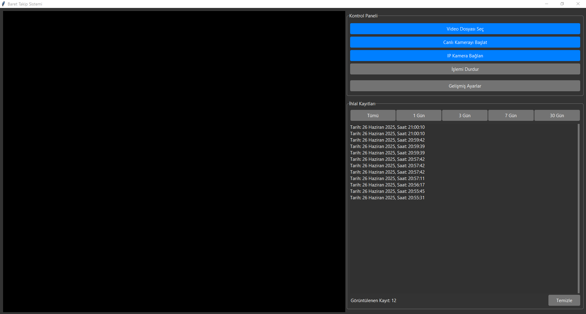
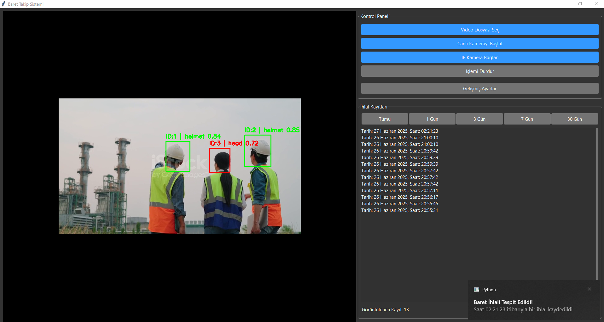
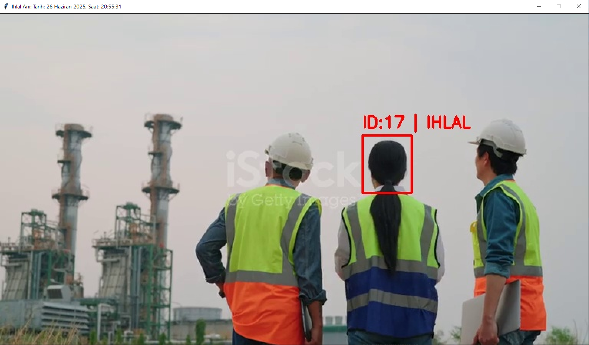
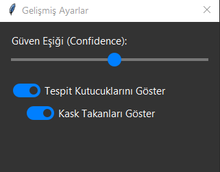

# Real-Time Hard Hat Detection System


This application provides a real-time solution for monitoring workplace safety by automatically detecting whether personnel are wearing hard hats.

## 📖 Table of Contents
- [Key Features](#-key-features)
- [Screenshots](#-screenshots)
- [Technology Stack](#-technology-stack)
- [Installation & Setup](#-installation--setup)
- [Usage](#-usage)
- [Project Structure](#-project-structure)
- [License](#-license)

## ✨ Key Features

- **Real-Time Detection:** Analyzes video streams from files, webcams, or IP cameras in real-time.
- **High-Accuracy Model:** Utilizes the YOLOv8s object detection model for fast and accurate identification of heads, helmets, and persons.
- **Graphical User Interface:** A user-friendly desktop application built with Tkinter, providing easy control over the system.
- **Violation Logging:** Automatically logs every detected hard hat violation with a timestamp and saves a corresponding image for evidence.
- **Desktop Notifications:** Sends instant desktop notifications when a violation occurs.
- **Configurable Settings:** Allows users to adjust the detection confidence threshold and toggle the visibility of bounding boxes through an advanced settings panel.
- **Hybrid Cooldown System:** Employs both tracking-based and spatial cooldowns to prevent redundant logging of the same violation event.

## 🖼️ Screenshots


| Main Application Window | Real-Time Detection Example |
| :---: | :---: |
| ** | ** |

| Violation Log & Details | Advanced Settings |
| :---: | :---: |
| ** | ** |


## 🛠️ Technology Stack

- **Backend:** Python 3.9+
- **Deep Learning / CV:**
  - [PyTorch](https://pytorch.org/)
  - [Ultralytics YOLOv8](https://github.com/ultralytics/ultralytics)
  - [OpenCV-Python](https://opencv.org/)
- **GUI:**
  - [Tkinter](https://docs.python.org/3/library/tkinter.html) (and `ttk` with the Azure-dark theme)
- **Image Handling:** [Pillow (PIL)](https://python-pillow.org/)
- **Notifications:** [Plyer](https://github.com/kivy/plyer)

## ⚙️ Installation & Setup

Follow these steps to set up and run the project on your local machine.

**1. Clone the repository:**
```bash
git clone [https://github.com/](https://github.com/)[hazar9]/[hardhat_dedection].git
cd [hardhat_dedection]
```

**2. Create and activate a virtual environment (Recommended):**
- On macOS/Linux:
  ```bash
  python3 -m venv venv
  source venv/bin/activate
  ```
- On Windows:
  ```bash
  python -m venv venv
  .\venv\Scripts\activate
  ```

**3. Install dependencies:**
A `requirements.txt` file should be created with the necessary libraries. Install them using pip:
```bash
pip install -r requirements.txt
```
*Contents of `requirements.txt`:*
```txt
ultralytics
opencv-python
pillow
plyer
```

**4. Download the Model:**
- The system requires the trained YOLOv8 model weights file (`best.pt`).
- Place the `best.pt` file inside the `models/` directory.

## 🚀 Usage

Once the setup is complete, run the main application file from the project's root directory:

```bash
python main.py
```

- Use the buttons in the "Control Panel" to start analysis from a video file, a live webcam, or an IP camera URL.
- Detected violations will be logged in the "Violation Records" panel.
- Click on any log entry to view the captured image of the violation.
- Use the "Advanced Settings" button to fine-tune the detection parameters.

## 📁 Project Structure

```
.
├── models/
│   └── best.pt           # YOLOv8 model weights
├── theme/
│   └── azure.tcl         # Theme file for the GUI
├── config.py             # Central configuration file
├── main.py               # Main application entry point
├── ui_manager.py         # GUI layout and management
├── video_processor.py    # Video processing and detection logic
└── requirements.txt      # Project dependencies
```

## 📄 License

This project is licensed under the MIT License. See the [LICENSE](LICENSE) file for more details.

---
